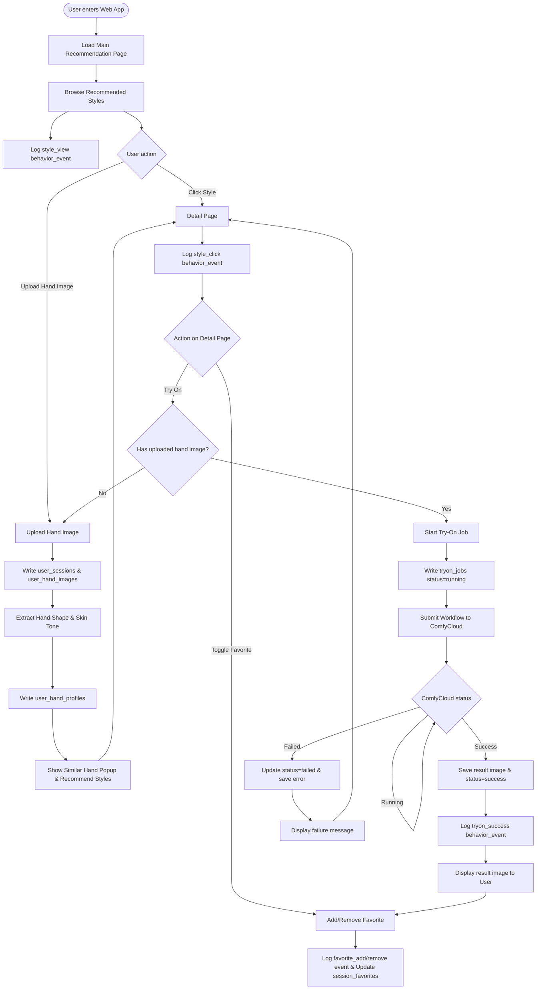
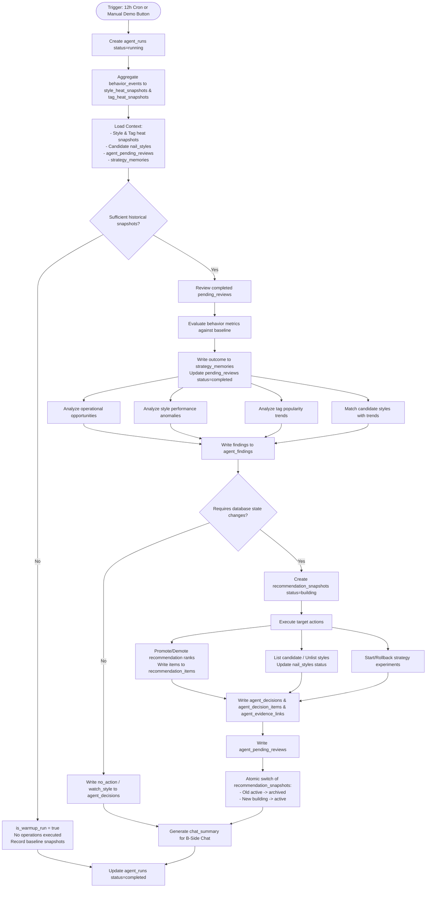

# Nails-Agent · Design Diagrams

Document Version: v1 · 2026-06-03
Companion Schema: [`docs/data-model.md`](./data-model.md)

This document contains visual diagrams for the Nails-Agent system designed according to the DB Schema V1. All diagrams are written using Mermaid syntax and can be rendered directly by Markdown viewers or converted to Draw.io diagrams.

---

## 1. Database Entity-Relationship Diagram (ERD)

The following diagram illustrates all 21 tables, their fields, types, and primary/foreign key relationships.

```mermaid
erDiagram
    NAIL_STYLES {
        string style_id PK
        enum source_type
        enum status
        string image_url
        string enhanced_image_url
        json_array color_tags
        json_array length_tags
        string visual_feature_id FK
        bool is_available_for_tryon
        datetime listed_at
        datetime created_at
        datetime updated_at
    }
    NAIL_VISUAL_FEATURES {
        string visual_feature_id PK
        string style_id FK
        string primary_color_family
        string primary_color_name
        json_array primary_color_rgb
        json_array dominant_palette
        float color_confidence
        string nail_crop_url
        enum length_tag
        float length_ratio
        float length_confidence
        string extractor_version
        json_object raw_features
        datetime created_at
    }
    USER_SESSIONS {
        string session_id PK
        string client_id
        string status
        string current_hand_image_id FK
        datetime created_at
        datetime closed_at
    }
    USER_HAND_IMAGES {
        string hand_image_id PK
        string session_id FK
        string image_url
        datetime created_at
    }
    USER_HAND_PROFILES {
        string hand_profile_id PK
        string session_id FK
        string hand_image_id FK
        enum hand_shape
        float hand_shape_confidence
        enum skin_tone
        float skin_tone_confidence
        json_array skin_rgb
        json_object raw_metrics
        datetime created_at
    }
    BEHAVIOR_EVENTS {
        string event_id PK
        string session_id FK
        string style_id FK
        enum event_type
        string source_page
        json_object metadata
        datetime created_at
    }
    SESSION_FAVORITES {
        string session_id PK
        string style_id PK
        bool is_active
        datetime created_at
        datetime updated_at
    }
    TRYON_JOBS {
        string tryon_job_id PK
        string session_id FK
        string style_id FK
        string hand_image_id FK
        enum status
        string input_hand_image_url
        string style_image_url
        string result_image_url
        string error_message
        string comfyui_workflow_id
        datetime created_at
        datetime started_at
        datetime finished_at
    }
    RECOMMENDATION_SNAPSHOTS {
        string snapshot_id PK
        string snapshot_type
        string session_id FK
        string generated_by
        string agent_run_id FK
        string status
        datetime activated_at
        datetime expires_at
        datetime created_at
    }
    RECOMMENDATION_ITEMS {
        string item_id PK
        string snapshot_id FK
        string style_id FK
        int rank_no
        float score
        string reason
        json_object score_detail
    }
    STYLE_HEAT_SNAPSHOTS {
        string heat_snapshot_id PK
        string agent_run_id FK
        string style_id FK
        datetime window_start
        datetime window_end
        int view_count
        int click_count
        int tryon_count
        int favorite_count
        float heat_score
        float growth_score
        float conversion_score
        datetime created_at
    }
    TAG_HEAT_SNAPSHOTS {
        string tag_snapshot_id PK
        string agent_run_id FK
        string tag_type
        string tag_value
        datetime window_start
        datetime window_end
        int style_count
        int view_count
        int click_count
        int tryon_count
        int favorite_count
        float heat_score
        float growth_score
        float conversion_score
        datetime created_at
    }
    AGENT_RUNS {
        string agent_run_id PK
        enum trigger_type
        string status
        bool is_warmup_run
        json_object input_summary
        json_object output_summary
        text chat_summary
        text error_message
        datetime started_at
        datetime completed_at
    }
    AGENT_FINDINGS {
        string finding_id PK
        string agent_run_id FK
        enum finding_type
        string target_type
        string target_id
        string title
        text summary
        json_object evidence
        float score
        datetime created_at
    }
    AGENT_DECISIONS {
        string decision_id PK
        string agent_run_id FK
        enum action_type
        string target_type
        string target_id
        string title
        text summary
        string status
        json_object execution_result
        bool requires_review
        datetime created_at
        datetime executed_at
    }
    AGENT_DECISION_ITEMS {
        string decision_item_id PK
        string decision_id FK
        string style_id FK
        string item_action_type
        string from_status
        string to_status
        int rank_before
        int rank_after
        json_object metrics_before
        text reason
        datetime created_at
    }
    AGENT_EVIDENCE_LINKS {
        string evidence_link_id PK
        string decision_id FK
        string source_type
        string source_id
        string role
        text note
        datetime created_at
    }
    AGENT_PENDING_REVIEWS {
        string pending_review_id PK
        string decision_id FK
        string style_id FK
        string review_type
        string status
        json_object before_metrics
        datetime review_window_start
        datetime review_window_end
        json_object result_metrics
        text result_summary
        string memory_id FK
        datetime created_at
        datetime updated_at
    }
    STRATEGY_MEMORIES {
        string memory_id PK
        string memory_type
        string source_pending_review_id FK
        string source_decision_id FK
        string tag_signature
        string style_id
        string action_type
        json_object before_metrics
        json_object after_metrics
        float outcome_score
        text lesson
        datetime created_at
    }
    AGENT_CHAT_SESSIONS {
        string chat_session_id PK
        datetime created_at
        datetime updated_at
    }
    AGENT_CHAT_MESSAGES {
        string message_id PK
        string chat_session_id FK
        string role
        text content
        json_array related_run_ids
        json_array related_finding_ids
        json_array related_decision_ids
        json_array related_memory_ids
        datetime created_at
    }

    NAIL_STYLES ||--|| NAIL_VISUAL_FEATURES : "has"
    NAIL_STYLES ||--o{ BEHAVIOR_EVENTS : "receives"
    NAIL_STYLES ||--o{ TRYON_JOBS : "tested_in"
    NAIL_STYLES ||--o{ RECOMMENDATION_ITEMS : "included_in"
    NAIL_STYLES ||--o{ AGENT_DECISION_ITEMS : "affected_by"

    USER_SESSIONS ||--o{ USER_HAND_IMAGES : "uploads"
    USER_SESSIONS ||--o{ USER_HAND_PROFILES : "analyzed_in"
    USER_SESSIONS ||--o{ BEHAVIOR_EVENTS : "performs"
    USER_SESSIONS ||--o{ TRYON_JOBS : "requests"
    USER_SESSIONS ||--o{ SESSION_FAVORITES : "has_favorites"

    RECOMMENDATION_SNAPSHOTS ||--o{ RECOMMENDATION_ITEMS : "contains"
    
    AGENT_RUNS ||--o{ STYLE_HEAT_SNAPSHOTS : "generates_style_heat"
    AGENT_RUNS ||--o{ TAG_HEAT_SNAPSHOTS : "generates_tag_heat"
    AGENT_RUNS ||--o{ AGENT_FINDINGS : "identifies"
    AGENT_RUNS ||--o{ AGENT_DECISIONS : "makes"
    AGENT_RUNS ||--o{ RECOMMENDATION_SNAPSHOTS : "creates_snapshot"

    AGENT_DECISIONS ||--o{ AGENT_DECISION_ITEMS : "details"
    AGENT_DECISIONS ||--o{ AGENT_EVIDENCE_LINKS : "references"
    AGENT_DECISIONS ||--o{ AGENT_PENDING_REVIEWS : "triggers_review"

    AGENT_PENDING_REVIEWS |o--o| STRATEGY_MEMORIES : "crystallizes_into"
    AGENT_CHAT_SESSIONS ||--o{ AGENT_CHAT_MESSAGES : "contains_messages"
```

---

## 2. C-Side User Journey & Interaction Flow (UserFlow)

This flowchart represents the journey of a C-side user from landing on the main recommendation page, uploading their hand images, receiving custom recommendations based on hand shape/skin tone, trying on nail designs via ComfyUI, and adding designs to their favorites list.

---

## 3. B-Side Agent Closed-Loop Operation Flow

This diagram illustrates the lifecycle of the B-side autonomous Operation Agent, which runs periodically to analyze user behaviors, identify opportunities/anomalies, perform decisions, and update recommendation snapshots.

---

## 4. End-to-End System Data Flow

This high-level data flow diagram illustrates how data flows from C-side user events into the analytics pipeline, processed by the Agent, and flows back into C-side recommendations.

```mermaid
flowchart TD
    %% Users and Frontend
    U([C-Side User]) <--> |Interacts| FE[C-Side Frontend]
    
    %% API layer
    subgraph Backend [Backend API Service]
        REST[FastAPI Router]
        AR[Agent Runner]
        JOBS[Try-On Job Worker]
    end
    
    %% Third-party
    subgraph Cloud [External Services]
        Comfy[ComfyCloud Service]
    end
    
    %% DB Tables Grouped
    subgraph Database [SQLite DB]
        subgraph StylesData [Styles Data]
            T_styles[(nail_styles)]
            T_features[(nail_visual_features)]
        end
        
        subgraph UserData [User Session Data]
            T_sessions[(user_sessions)]
            T_images[(user_hand_images)]
            T_profiles[(user_hand_profiles)]
        end
        
        subgraph ActivityData [User Activity Data]
            T_events[(behavior_events)]
            T_favorites[(session_favorites)]
            T_jobs[(tryon_jobs)]
        end
        
        subgraph RecsData [Recommendation Data]
            T_snapshots[(recommendation_snapshots)]
            T_items[(recommendation_items)]
        end
        
        subgraph HeatData [Analytics Heat]
            T_style_heat[(style_heat_snapshots)]
            T_tag_heat[(tag_heat_snapshots)]
        end
        
        subgraph AgentData [Agent State Data]
            T_runs[(agent_runs)]
            T_findings[(agent_findings)]
            T_decisions[(agent_decisions)]
            T_pending[(agent_pending_reviews)]
            T_memories[(strategy_memories)]
        end
    end
    
    %% Data Flows
    FE -->|1. Log Event| REST
    REST -->|Write Event| T_events
    REST -->|Write/Update| T_sessions & T_favorites
    
    FE -->|2. Upload Hand| REST
    REST -->|Write Hand Image| T_images
    REST -->|Run CV Extraction| T_profiles
    
    FE -->|3. Trigger Tryon| REST
    REST -->|Write Running Job| T_jobs
    REST -->|Request Tryon| JOBS
    JOBS -->|Submit workflow with hand/style| Comfy
    Comfy -->|Return result image| JOBS
    JOBS -->|Write Success Image| T_jobs
    
    %% Agent loop
    AR -->|1. Trigger Rollup| T_events
    T_events -->|Aggregate| T_style_heat & T_tag_heat
    
    AR -->|2. Read History| T_style_heat & T_tag_heat & T_memories & T_pending
    AR -->|3. Record Run & Findings| T_runs & T_findings
    AR -->|4. Execute Decisions| T_decisions & T_pending
    
    AR -->|5. Update Styles status| T_styles
    AR -->|6. Generate Recs| T_snapshots & T_items
    
    %% C-side Read path
    REST -->|Read active snapshot| T_snapshots
    T_snapshots -->|Load items & styles| T_items & T_styles
    REST -->|Deliver Recommendations| FE
```

