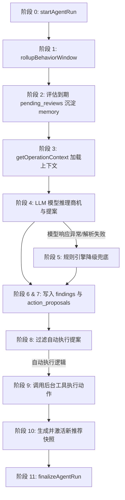

# 智能运营 Agent 控制中心模块

本模块详细记录了 **Nails-Agent** 智能运营中枢的设计思路与具体实现。该控制中心定期启动，执行平台经营指标监控、款式推荐权重微调及款式生命周期流转。

---

## 模块概述

Agent 控制中心存放在 [orchestrator.ts](file:///Users/nev4rb14su/workspace/nails-agent/src/agent/orchestrator.ts) 中，它依赖 [tools.ts](file:///Users/nev4rb14su/workspace/nails-agent/src/agent/tools.ts) 提供的各项数据库封装工具来改写业务状态。

Agent 巡检的底层周期为 12 小时（在 Demo 演示阶段，可通过 B 端看板上的手动触发按钮直接运行一轮），并提供 5 大核心业务决策能力：
1. **商机发现**：寻找具有爆发潜力的款式或标签组合。
2. **主推荐流微调**：按平台全局的流行趋势重新对主推荐快照进行排序。
3. **款式生命周期流转**：判断候选款式是否达到上架阈值，或将表现不佳的已上架款式下架回候选池。
4. **策略复盘与记忆沉淀**：评估前期决策带来的反馈指标（如点击率变化），沉淀正面或负面的教训经验。
5. **服务健康异常诊断**：诊断如高浏览低点击、试戴失败率偏高等系统运营指标故障。

---

## Agent 的 11 阶段执行流程

### 阶段 0：初始化运行
向数据库 `agent_runs` 写入一条状态为 `running` 的新运行记录。

### 阶段 1：聚合本轮表现数据
统计当前周期（12小时）内各款式的曝光、点击、试戴和收藏数，生成对应的 `style_heat_snapshots` 和 `tag_heat_snapshots` 记录。

### 阶段 2：到期提案复盘
检索已经超出观察窗口的 `agent_pending_reviews`。计算实施该运营动作前后的指标增幅，得出反馈成效，并将运营教训写入 `strategy_memories` 长期记忆库中。

### 阶段 3：加载上下文
提取当前最新的款式热度快照、标签热度、候选池数据以及历史策略记忆，组成 Agent 大模型提示词的输入载荷。

### 阶段 4：大模型诊断与方案生成
向 ModelScope 平台上的 MiniMax LLM 提交提示词。模型会返回 JSON 格式的推理结果：
- **发现（Findings）**：识别当前在哪些标签或款式上存在商机或异常。
- **提案（Proposals）**：建议对特定款式进行提权、降权、从候选池上架或下架。

### 阶段 5：规则引擎兜底
若 LLM 接口调用超时、解析 JSON 错误或返回格式不对，系统会触发 [runRuleBasedEngine](file:///Users/nev4rb14su/workspace/nails-agent/src/agent/orchestrator.ts#L178) 进行规则降级：
- 检索符合当前流行标签趋势的候选款式，自动推荐上架。
- 检索点击到试戴转化率低于 10% 的款式，生成异常诊断。

### 阶段 6 & 7：落库保存
将发现与提案分别存入 `agent_findings` 与 `agent_action_proposals`。

### 阶段 8 & 9：过滤并自动执行
所有决策遵循**免人工审核自动生效**（`requiresReview: false`）的策略：
- `adjustRecommendation`：在排序列中调升或调降款式的位置。
- `listCandidate`：将候选美甲款式状态改为 `listed` 上架展示。
- `unlistToCandidate`：将表现落后的美甲下架，放回候选池。

### 阶段 10：原子切换推荐快照
编译生成一套全新的 `recommendation_snapshots`（状态 `active`），并将旧的主推荐快照标记为 `archived`。前端刷新页面后便可立即读取最新的排列序列。

### 阶段 11：巡检归档
在 `agent_runs` 中归档输出摘要，并将状态置为 `completed`。

---

## 核心计算公式定义 (`src/agent/tools.ts`)

- **款式累积热度算法**：
  $$\text{heatScore} = (\text{点击数} \times 1.0) + (\text{试戴成功数} \times 2.0) + (\text{收藏数} \times 3.0)$$
- **点击转化率算法**：
  $$\text{conversionScore} = \left(\frac{\text{试戴成功数}}{\max(\text{点击数}, 1)} \times 0.6\right) + \left(\frac{\text{收藏数}}{\max(\text{点击数}, 1)} \times 0.4\right)$$

