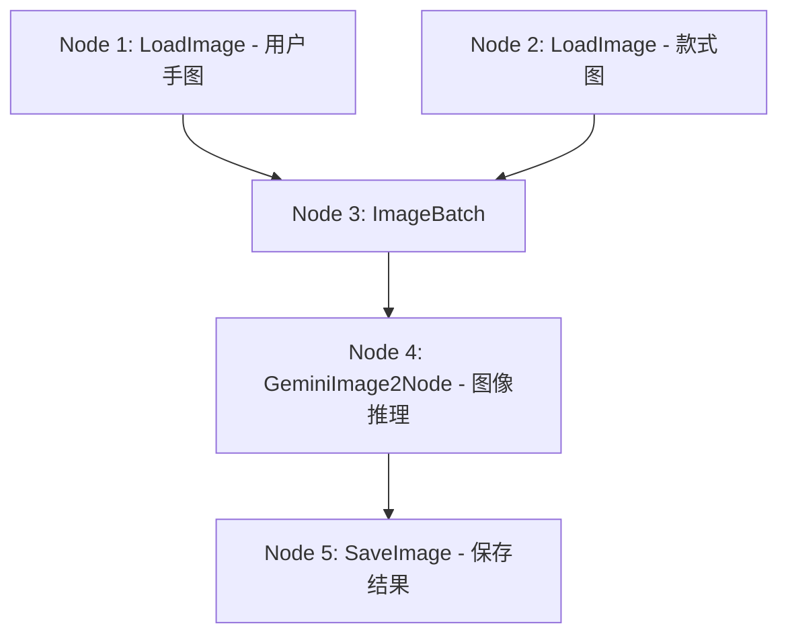

# 虚拟试戴与 ComfyCloud 集成模块

本模块详细记录了通过 ComfyCloud API 在云端渲染引擎上实现将美甲款式融合到消费者手部照片中的虚拟试戴管线。

---

## 模块概述

虚拟试戴核心调度服务存放在 [comfycloud.ts](file:///Users/nev4rb14su/workspace/nails-agent/src/services/comfycloud.ts) 中。它管理与远程 ComfyUI 云端工作流引擎的通信，执行 AI 图像到图像的图生图转换：
1. **上传资产**：将消费者的手部图片和目标美甲款式图上传至 ComfyCloud 服务器。
2. **执行图纸工作流**：提交包含图像加载、通道拼接和 GenAI 推理的 ComfyUI JSON 图纸。
3. **退避轮询**：周期性查询生成任务的状态。
4. **下载结果**：下载最终生成的 PNG 文件并存储在本地目录，以供前端渲染。

---

## 环境配置

- `COMFYCLOUD_BASE`：ComfyCloud 接口基地址（默认为 `https://cloud.comfy.org/api`）。
- `COMFYCLOUD_API_KEY`：API 授权令牌。若此变量为空，服务将自动切换至 **Mock 模式**，直接生成模拟的成功结果，确保无 Key 时主链路依然畅通。

---

## ComfyUI 工作流图纸设计

工作流结构由 [buildTryonWorkflow](file:///Users/nev4rb14su/workspace/nails-agent/src/services/comfycloud.ts#L170) 函数动态组装：



### 提示词引导指令 (`PROMPT_WITH_HAND`)
生成模型 **Nano Banana 2** (基于 Gemini 3.1 Flash Image 架构) 遵循以下核心提示词规则：
1. **手模还原**：输入图 1 (IMAGE 1) 是基准手部模型。必须 100% 还原图 1 中的手部结构、手指姿态、皮肤色泽、画面构图以及背景。不得修改手型，不得增减手的数量。
2. **款式迁移**：输入图 2 (IMAGE 2) 仅作为美甲款式设计参考。彻底忽略图 2 中的手部骨骼、手指、背景以及画面构图。仅提取图 2 中指甲的颜色、手绘图案、反光材质（如光疗/哑光/猫眼）以及立体装饰（如水钻、金箔、3D 饰品），并将该设计涂抹在图 1 手模的每一个指甲上。
3. **立体渲染**：将设计自然包裹在每个指甲的 3D 弧度表面，配合逼真的镜面反射高光与指缘阴影，确保生成画质达到精美的画册画质。

---

## 异步处理与轮询策略

由于 AI 生图任务耗时通常在 15~30 秒之间：
1. **任务初始化**：接口 `POST /api/tryon-jobs` 收到请求后，先向数据库 `tryon_jobs` 插入一条状态为 `pending` 的记录，随后在后台静默启动整个异步集成流程。
2. **多表单上传**：将手部图片和款式参考图分别通过 `POST /upload/image` 接口推送到云端缓存，得到对应的云端文件名。
3. **提交图纸**：将组装好的 JSON 工作流工作图通过 `POST /prompt` 提交，获取任务的唯一凭证 `prompt_id`。
4. **指数退避轮询**：每隔 3 秒请求 `GET /jobs/:promptId` 查询状态。若在轮询中遇到网络抖动或临时请求报错，服务会启用 **指数退避（Exponential Backoff）重试算法**（初试间隔 1,000ms，每次出错间隔翻倍，最高增至 30,000ms），保障长连接轮询的健壮性。
5. **落盘持久化**：检测到状态变为 `completed` 后，调用 [downloadView](file:///Users/nev4rb14su/workspace/nails-agent/src/services/comfycloud.ts#L145) 下载图像二进制文件。将其保存至 `/data/tryon_results/` 目录下，并更新数据库任务状态为 `success`，同时记录本地图片文件访问 URL。
6. **前端感知**：C 端页面在提交试戴任务后，会以 2 秒为间隔拉取任务状态，待拿到 `success` 结果后将试戴成功图在弹窗中渲染呈现。

---

## 代码级调用示例

```typescript
// 1. 生成图纸并提交任务，获取 promptId
const promptId = await submitPrompt(buildTryonWorkflow(uploadedHandName, styleName));

// 2. 轮询等待任务进入终态（completed | failed）
const jobResult = await pollJob(promptId);

// 3. 提取输出图像并写入本地
if (jobResult.status === 'completed') {
  const images = extractOutputs(jobResult);
  const buffer = await downloadView(images[0].filename);
  await fs.promises.writeFile(localOutputPath, buffer);
}
```

