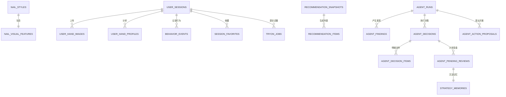

# 数据库与表结构模块

本模块详细记录了 **Nails-Agent** 平台的数据库架构、表结构定义、ORM 配置以及数据种子填充策略。

---

## 技术栈选择

- **数据库引擎**：SQLite 3（启用 WAL 日志模式以提高并发读写性能，强制开启外键约束）
- **驱动库**：`better-sqlite3`
- **ORM 框架**：`drizzle-orm`
- **迁移与架构同步工具**：`drizzle-kit`

---

## 目录结构

```text
db/
├── src/
│   ├── schema/             # 数据库表结构 schema 定义
│   │   ├── style.ts        # 美甲款式及视觉特征
│   │   ├── sessions.ts     # 用户会话及手部特征文件
│   │   ├── behavior.ts     # 用户行为事件、收藏及试戴任务
│   │   ├── recommend.ts    # 全局与推荐快照数据
│   │   ├── heat.ts         # 款式与标签性能热度指标
│   │   ├── agent.ts        # 智能运营 Agent 运行记录、决策及 Chat 对话
│   │   └── index.ts        # 统一导出入口
│   ├── seed/
│   │   └── index.ts        # 初始款式入库与 Mock 行为数据生成种子脚本
│   ├── client.ts           # Drizzle 与 Better-SQLite3 初始化连接
│   ├── paths.ts            # 环境配置解析与数据目录定义
│   ├── reset.ts            # 数据库清理重置工具
│   └── check.ts            # 架构校验脚本
├── drizzle.config.json     # Drizzle 配置文件
└── package.json            # 子包 package 声明
```

---

## 关系实体与表结构分组

数据库共分为 6 个核心数据模块，用以维护平台的完整运行状态：



### 1. 款式模块 (`db/src/schema/styles.ts`)
- **`nail_styles`**：美甲款式主表。状态 `status` 为 `candidate`（候选池，未上架）或 `listed`（已上架展示）。
- **`nail_visual_features`**：从美甲图提取的颜色分类、主色 RGB、调色盘、指甲抠图以及长度比例。

### 2. 会话模块 (`db/src/schema/sessions.ts`)
- **`user_sessions`**：C 端消费者打开应用产生的交互会话。
- **`user_hand_images`**：上传的手部图片元数据。
- **`user_hand_profiles`**：计算机视觉识别出的手型（`slender_long` 细长型, `short_wide` 宽短型等）以及肤色结果。

### 3. 行为模块 (`db/src/schema/behavior.ts`)
- **`behavior_events`**：记录原子用户行为，包括：`style_view`（曝光）、`style_click`（点击）、`tryon_success`（试戴成功）、`favorite_add`（收藏）和 `favorite_remove`（取消收藏）。
- **`session_favorites`**：会话内处于收藏状态的美甲款式。
- **`tryon_jobs`**：ComfyCloud 异步试戴任务的工作流状态。

### 4. 推荐模块 (`db/src/schema/recommend.ts`)
- **`recommendation_snapshots`**：主推荐流的全局快照（`global_main`，状态为 `active` 激活或 `archived` 已归档）。
- **`recommendation_items`**：推荐快照中所包含的美甲款式排序与推荐理由。

### 5. 热度分析模块 (`db/src/schema/heat.ts`)
- **`style_heat_snapshots`**：每 12 小时聚合一次的单款美甲点击、试戴、收藏热度及转化评分。
- **`tag_heat_snapshots`**：按颜色标签、长度标签聚合的流行趋势数据。

### 6. 运营中枢模块 (`db/src/schema/agent.ts`)
- **`agent_runs`**：Agent 的历次巡检记录。
- **`agent_findings`**：Agent 扫描指标得出的商机发现或异常诊断。
- **`agent_decisions`**：Agent 决策并自动执行的动作（如提升某款式的推荐权重）。
- **`agent_action_proposals`**：Agent 提出的策略假设与方案。
- **`agent_pending_reviews`**：需要进行效果复盘的动作及期限。
- **`strategy_memories`**：复盘后沉淀的指导经验。
- **`agent_chat_sessions` 与 `agent_chat_messages`**：B 端用户与运营 Agent 的多轮问答对话记录。

---

## 命名转换规则

为保持各层代码的清晰与规范：
1. **数据库物理层**：所有字段名使用 `snake_case`（蛇形命名法），如 `style_id`，`is_active`。
2. **API 传输层**：前后端交互的 JSON 数据统一使用 `camelCase`（驼峰命名法），如 `styleId`，`isActive`。
3. 后端服务在处理 API 请求与响应时，负责在实体类和 JSON 载荷之间进行键名的自动映射与转换。

---

## 初始化种子与 Mock 行为数据生成

初始化种子脚本 [seed/index.ts](file:///Users/nev4rb14su/workspace/nails-agent/db/src/seed/index.ts) 会读取本地 Manifest 清单并导入 100 张款式图片（50 张 listed 上架，50 张 candidate 候选）。

此外，脚本还会生成初始用户点击数据以供 Agent 启动后读取：
1. **Mock 规模**：默认生成 **50 个交互 Session**，每个会话生成 **10~15 个行为事件**。
2. **时间跨度**：模拟事件散落在最近 **3 天**内，产生历史时间轴。
3. **特征偏好模拟**：
   - 识别为 `slender_long`（纤长）手型的 Session，会有更大概率去点击、试戴或收藏裸色系（`nude`）以及中长款美甲。
   - 识别为 `short_wide`（宽扁）手型的 Session，会偏好短款（`short`）美甲与高对比度亮色系。
   - 这能保证 Agent 巡检时可以扫描出有规律的趋势商机，而非纯随机杂乱数据。

---

## 数据库维护指令

请在数据库工作区或根目录下执行以下指令进行库表操作：

```bash
# 同步 schema 修改至物理 SQLite 数据库
bun run db:push

# 生成 Drizzle Kit 迁移文件
bun run db:generate

# 打开 Drizzle Studio 数据库浏览器
bun run db:studio

# 运行数据初始化与 Mock 数据生成种子脚本
bun run db/src/seed/index.ts
```

