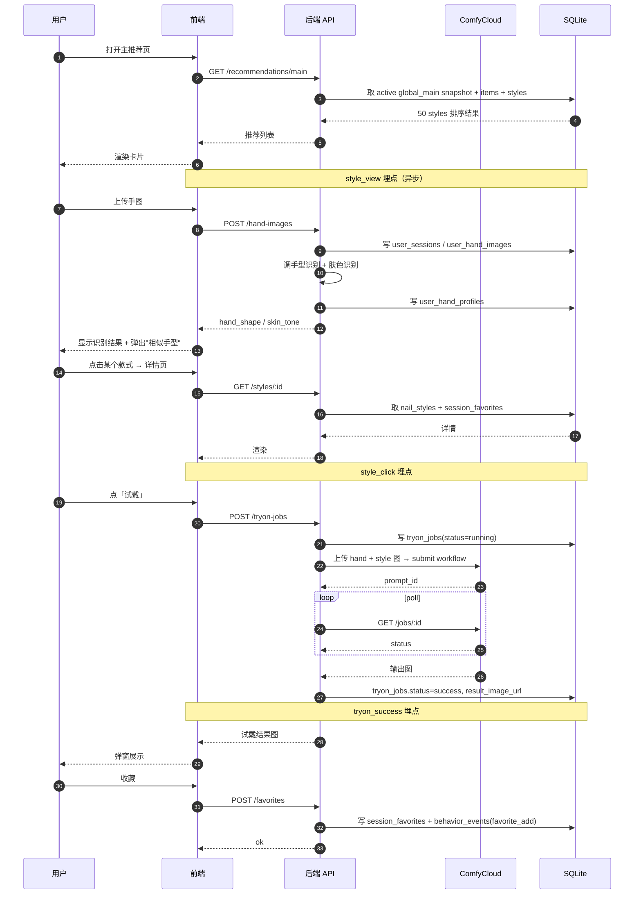
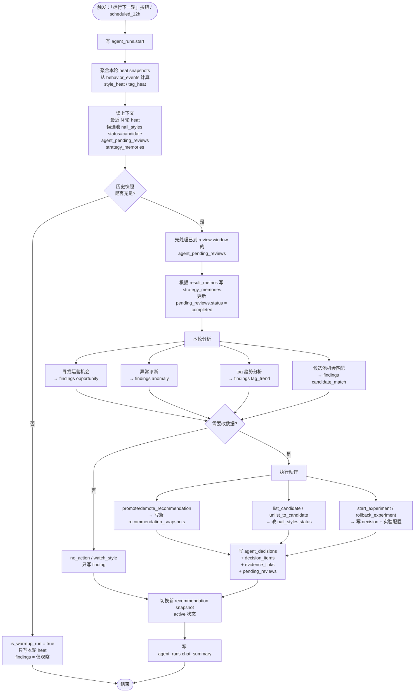
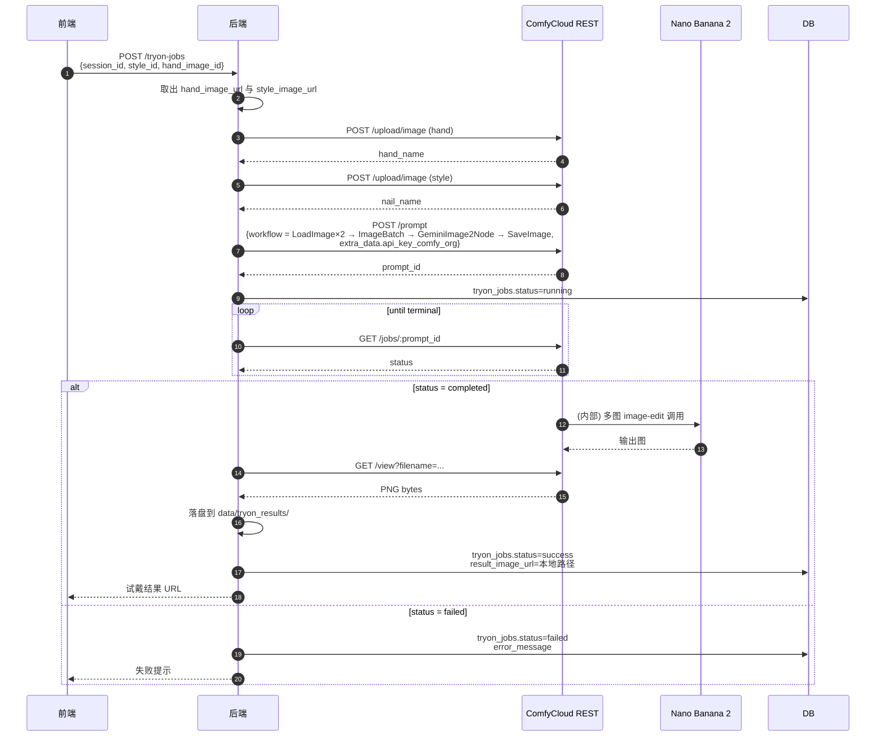
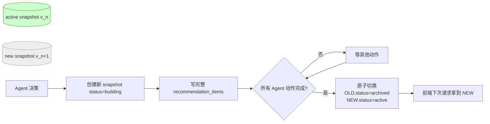
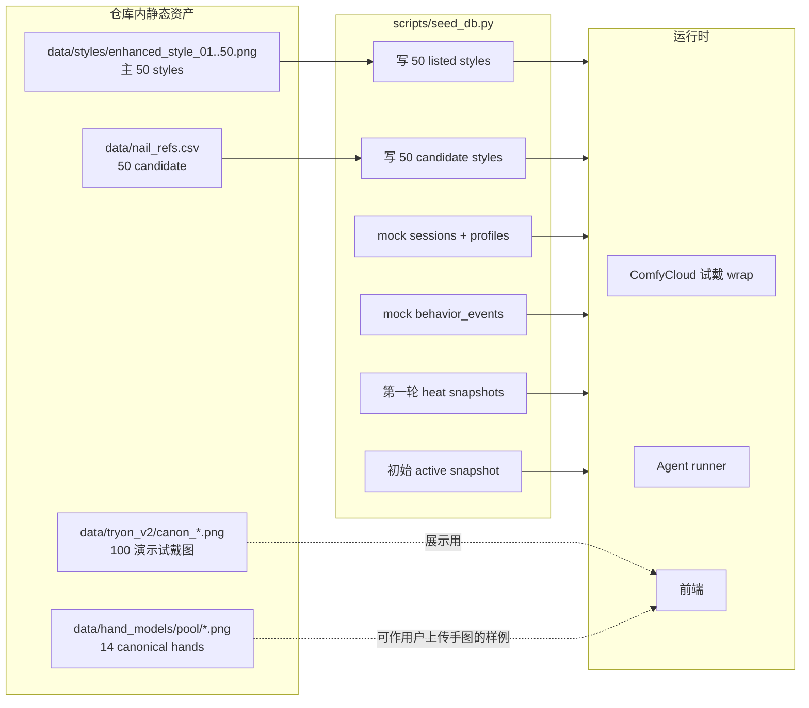

# Nails-Agent · 系统流程图

文档版本：v1 · 2026-06-03
配套 PRD：[`docs/PRD.md`](./PRD.md)
配套 schema：[`docs/data-model.md`](./data-model.md)

> 所有图均为 Mermaid 源码，GitHub / VSCode / Obsidian 等可直接渲染。

---

## 1. 高层系统架构

```mermaid
flowchart LR
    subgraph C [C 端]
        C1[主推荐页]
        C2[详情页]
        C3[手图上传 + 识别]
        C4[相似手型弹窗]
        C5[试戴流程]
        C6[收藏夹]
    end

    subgraph B [B 端]
        B1[Agent 看板]
        B2[B 端 Chat]
        B3[「运行下一轮 Agent」按钮]
    end

    subgraph API [后端 API]
        A1[REST / FastAPI]
        A2[试戴 wrap: ComfyCloud + Nano Banana 2]
        A3[Agent runner]
        A4[Heat 聚合 job]
    end

    subgraph DB [(SQLite)]
        D1[nail_styles / visual_features]
        D2[user_sessions / hand_profiles]
        D3[behavior_events / favorites / tryon_jobs]
        D4[recommendation_snapshots / items]
        D5[style_heat / tag_heat snapshots]
        D6[agent_runs / findings / decisions / memories]
    end

    C --> A1
    B --> A1
    A1 --> DB
    A1 --> A2
    A1 --> A3
    A3 --> A4
    A4 --> D5
    A3 --> D6
    A3 --> D4
```

---

## 2. C 端用户旅程



---

## 3. B 端 Agent 一轮闭环



---

## 4. 试戴管线（最小细节）



---

## 5. 推荐快照切换（避免半更新状态）



---

## 6. 数据资产 ↔ 系统组件映射（v1 Demo）


